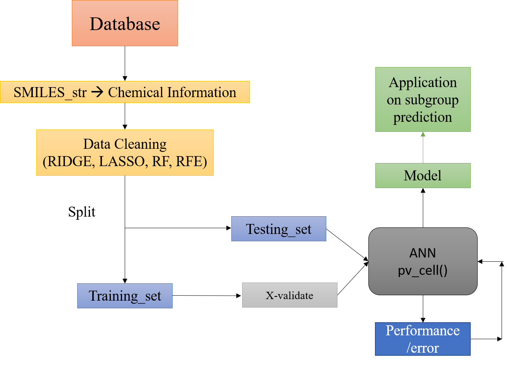

PVC is a group of four who dream of contributing to the clean energy technology. We developed a python package that can predict **Power Conversion Efficiency(PCE)** of an organic material in PV-Cell based on user's input molecular structure. The predicted model is built based on correlations between *PCE* and molecular features (bond type, functional group, heteroatom and etc.). All data is retrieved from The Harvard Clean Energy Project Database (HCEPDB). As our slogan said "STRONG!", we aimed at developing a powerful tool that provides practical information towards synthesizing new organic materials for OPVC.

## Use Cases
1. Extract molecular features (functional groups, chemical bonding and etc.) from given ``SMILE_str``.
2. Use various regression models to screen siginificant predictors from molecular features above that contribute to *PCE*.
3. Build up Artificial Neural Network(ANN) to connect selected molecular featrues and *PCE*.
4. (Future Work)Predict optimal structure that gives high PCE based on Terminal-Spacer-Core fragmented structures.

## Package Requirements
This package needs **RDkit** for molecular conversion and **Mordred** for descriptor calculation, **Pandas** for data management, **Scikit-learn** for standardisation and data set splitting, and **Keras** for the neural network building and training.

* RDkit
* Keras
* Scikit-learn
* Mordred

All required software can be installed at the command line
 * `pip install -r requirements.txt`
 
## Organization of the  project

The project has the following structure:

    PV_Cell/
      |- README.md
      |- pvcell/
         |- __init__.py
         |- pvcell.py
         |- due.py
         |- data/
            |- ...
         |- tests/
            |- ...
      |- doc/
         |- Makefile
         |- conf.py
         |- sphinxext/
            |- ...
         |- _static/
            |- ...
            |- ipynb/
      |- examples/
         |-pvcell.ipynb/
      |- setup.py
      |- .travis.yml
      |- .mailmap
      |- appveyor.yml
      |- LICENSE
      |- Makefile

## Work Flow

## Module code

We place all the module codes in the directory called `pvcell`. It contains modules
required for every step in the project, including: extracting chemical infomation, 
vaious regression model, ANN model and visualization module. Please see README file in 
the directory for more details. 

## Project Data

All the data used in this project are placed in the directory `database/`
(https://github.com/sjluozho/PV_Cell/tree/master/Database)recorded in csv
files. Users can call the data by this code:
    *data = pd.read_csv('../Database/HCEPD_100K.csv')*
In addition to the original data (*HCEPD_100K.csv*), we place some csv files that
contains raw chemical features extracted from this 100K data, and also the ready-to-use one
in `No_Missing_Value` folder.    

## Examples

This directory contains several Ipython Notebook that reads in some data, and run the modules in
this project as an demonstration. Users may find useful instruction and illustration of the codes
and procedures of our work.

## Installation
A `PV_Cell/version.py` contains all of the information needed for the
installation and package dependencies.

## Licensing

For more details on the licensing document, please read:
[MIT](https://github.com/sjluozho/PV_Cell/blob/master/LICENSE)
